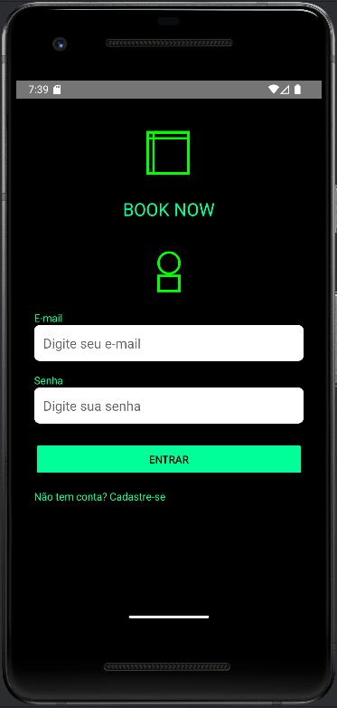

# 📱 BookNow - Livraria de eBooks


*BookNow* é um aplicativo móvel de livraria de eBooks, desenvolvido em Kotlin para a plataforma Android. O aplicativo permite aos usuários navegar por uma variedade de livros digitais, fazer login, explorar gêneros, ver detalhes das obras e concluir a compra de forma simples e intuitiva. A arquitetura do projeto segue práticas modernas de desenvolvimento Android, adicionar livros ao carrinho e concluir a compra de forma simples e intuitiva.

## 🔧 Funcionalidades

- *Cadastro e Login:* Permite ao usuário criar uma conta e fazer login para acessar a biblioteca de livros.
- *Lista de Livros:* Exibe uma lista de eBooks com detalhes, incluindo título, autor, e imagem da capa.
- *Categorias de Gêneros:* Permite filtrar os livros por categorias (gêneros).
- *Detalhes do Livro:* Exibe informações detalhadas sobre cada livro.
- *Compra:* O usuário pode adicionar livro e finalizar a compra sem burocracia.
- *Tela de Splash:* Exibe uma tela inicial ao abrir o aplicativo.

## 🛠️ Tecnologias Utilizadas

- *Kotlin:* Linguagem de programação utilizada para o desenvolvimento do aplicativo.
- *Android Studio:* Ambiente de desenvolvimento integrado (IDE) utilizado.
- *Gradle:* Sistema de automação de builds utilizado para gerenciar dependências e compilar o projeto.
- *Room:* Banco de dados local
- *Postgre:* Banco de dados em produção
- *Render:* Serviço que hospeda, escala e gerencia a API automaticamente.
- *Uptimerobot:* Realização de deploy automático.
- *API Flask + Python:* Para unir Postgre e Render.  (Repositório da API: https://github.com/Victor-Diniz-Dev/booknow-api)
- *JDK 17:* JDK necessário para rodar o projeto.
- *Arquitetura MVVM simplificado (Model-View-ViewModel):* O projeto segue uma arquitetura de camadas, separando responsabilidades entre UI, lógica de apresentação e acesso a dados.


## ✅ Pré-requisitos

Antes de executar o projeto, você precisará ter as seguintes ferramentas instaladas no seu ambiente de desenvolvimento:

- *JDK 17*.
- *Android Studio* com as ferramentas de SDK e NDK configuradas.
- *Gradle 8.5* 
- *8GB* de meória ram ou um celular android com usb para emular.

## 🧱 Como Executar o Projeto

1. *Clone o repositório:*
   ```bash
   git clone https://github.com/usuario/repo.git

2. *Abra o projeto no Android Studio:*
   - Vá até o Android Studio, clique em Open, e selecione a pasta do projeto.

3. *Configure o Gradle:*
   - O Gradle será automaticamente configurado ao abrir o projeto. Caso contrário, você pode forçar uma sincronização clicando em File > Sync Project with Gradle Files., configurar o

4. *Execute o projeto:*
   - Após a sincronização do Gradle, você pode executar o aplicativo em um dispositivo físico ou no emulador Android clicando no botão Run no Android Studio.

## 🧱 Estrutura do Projeto

O projeto está organizado da seguinte maneira:

- *app/*: Contém o código principal do aplicativo.
  - *java/com/example/booknow/*: Contém as Activities e classes de lógica do aplicativo.
    - CadastroActivity.kt: Tela de cadastro de usuário.
    - LoginActivity.kt: Tela de login do usuário.
    - ListaLivrosActivity.kt: Tela principal com a lista de livros.
    - DetalheLivroActivity.kt: Tela de detalhes de cada livro.
    - PagamentoActivity.kt: Tela para finalizar a compra.
    - SplashActivity.kt: Tela inicial do aplicativo.
    - Entre outras.
  - *res/*: Contém recursos como imagens, layouts e strings.
- *build.gradle*: Arquivo de configuração do Gradle para o aplicativo.

## ✅  Como Contribuir

1. *Fork o repositório* e faça um clone na sua máquina (ou pull sempre que for desenvolver algo novo e ja tiver o projeto).
2. Crie uma branch para a sua feature:
   bash
   git checkout -b minha-feature
   
3. Faça as alterações necessárias.
4. Teste suas alterações localmente.
5. Commit suas mudanças:
   bash
   git commit -am 'Add nova funcionalidade'
   
6. Faça push para a sua branch:
   bash
   git push origin minha-feature
   
7. Abra um pull request explicando as modificações feitas.

8. Aguarde o code review de um dos membros do repositório

##  📱 Tela Inicial do Aplicativo:

<p align="center">
  
</p>

## 💾 Sugestões de Melhorias

- Melhorar a lógica do carrinho com validação de quantidade máxima por produto e descontos progressivos.
- Adicionar descrição curta e longa para os livros.
- Implementar funcionalidade para presentear livros, com opção de mensagem personalizada.
- Criar descontos progressivos para compras em grande quantidade (ex: a cada 5 livros, 5% de desconto).
- Exibir banners de promoções e notificações durante o processo de compra.
- Melhorar a tela de checkout com resumo da compra e simplificação do pagamento.


